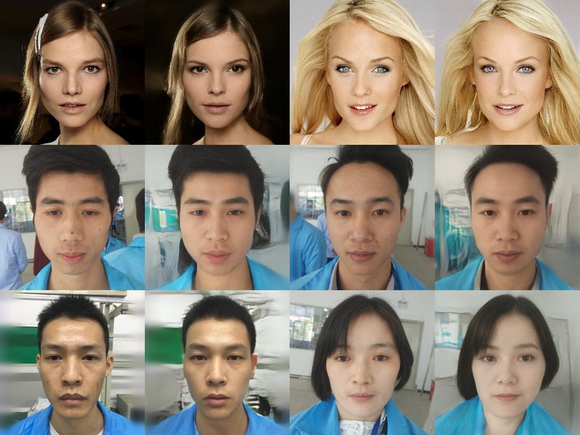

## FaceEdit_Targetly_FPN

Tensorflow implementation of FaceEdit_Target_FPN, which contains Feature-Extraction、Face-Reconstruction、Face-Interpolation、Face-Editing.

### Installation Requirements

We use GPU and CPU respectively for image generation, both of which can work normally. All the dependence have been packaged to **requirments.txt** and you can use it for installation.

```python
pip install -r requirments.txt
```

### Model File Preparation

At first, you need to download the model files, which is used as the generator and place it in **"./checkpoints"** dir. 

**[!!!]** **Attention**: we provider a variety of model files,  the diferece between prefix **fpn-1-\*** and **fpn-2-\*** are training data, and the result of **fpn-2-\*** is better , and the difference of **fpn-2-1**、**fpn-2-2** and **fpn-2-\*** is the iteration steps. And  the more iterations, the more stable the result. the model dir of prefix **fpn-id-loss-\***   is  ID_LOSS added. 

We recommend using **fpn_id_loss_4** or **fpn_2_5**. [DownloadLink](https://pan.baidu.com/s/1hQ_qy3y8zuGSKWcTa3QmGw)  **code:** ggan.

Secondly, you also need to download FPN model in resnet_v1_101,and place it in **"FPN/pretrained_weights/"**. [DownloadLink]( https://pan.baidu.com/s/1yHcQ9Yq20d7mmnytlT9VOQ) **code**: ffpn.

Maybe,we will combine the variety models, maybe not, there is no idea yet.

### Inference

Most htpermeters were defined in the corresponding file, and we only splited few parameters in  **inference.py** , by modifying it works normally when we are testing  script.

```python
MODEL_DIR=''   # which checkpoint to choose. eg:'./checkpoints/fpn_id_loss_4'
FILE_DIR=''    # images dir
META_PATH=''   # meta path
MODEL_PATH=''  # model path
SAVE_DIR=''    # reconstructed image save dir
```

After modifying the above parameters, then run the following script:

```bash
python inference.py
```

### Reconstructed Images

The **first** and **third** columns are the original images, and the **second** and **forth** columns are the reconstructed images.



### Image Interpolation

Besides Image Reconstruction, we also defined a function for image interpolation, the details can be found in **inference.py** line 85-98.  It can be  used as following example:

```python
sff=Specific_Face_FPN()
#sff.run()                # image reconstructe function
sff.interPolate('./test/images/1.jpg','./test/images/7.jpg')  # image interpolate fucntion
```

### Interpolate Results

The **first** and **last** columns is the input images, the intermediate images is incremented by **0.1 intensity**, and feature interpolate between scr1 and src2 .


### TODO

- [x] Feature-Extraction
- [x] Face-Reconstruction
- [x] Face-Interpolation
- [ ] Attribute-Regression
- [ ] Face-Editing


